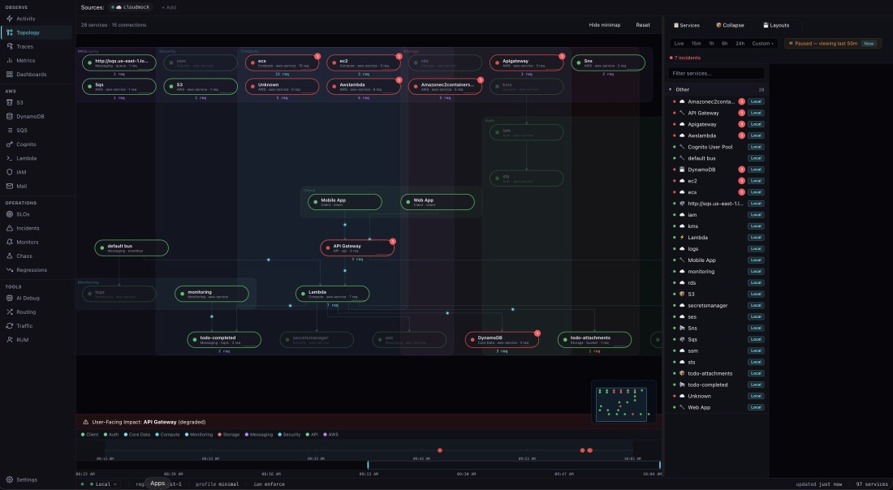

# CloudMock

**Local AWS emulation with built-in observability.**

98 AWS services + distributed tracing + error tracking + alerting — in one binary. Language-agnostic via OpenTelemetry.



## Quick Start

```bash
npx cloudmock
# or
brew install viridian-inc/tap/cloudmock
# or
sudo snap install cloudmock
# or
docker run -p 4566:4566 -p 4500:4500 ghcr.io/viridian-inc/cloudmock:latest
```

Point your AWS SDK:

```bash
export AWS_ENDPOINT_URL=http://localhost:4566
```

Open DevTools at [http://localhost:4500](http://localhost:4500)

## Why CloudMock?

- **98 AWS services** emulated locally — no AWS account needed
- **Full observability** — traces, metrics, logs, and errors in one dashboard
- **Language-agnostic** — works with any OpenTelemetry SDK (Go, Python, Java, Node, Rust, ...)
- **Built-in DevTools** — topology maps, request tracing, chaos engineering
- **Free for local dev and internal use** — source-available, no account required

## Usage

CloudMock is a drop-in replacement for AWS. Point any SDK at `localhost:4566`:

```js
// Node.js
const client = new S3Client({
  endpoint: "http://localhost:4566",
  region: "us-east-1",
  credentials: { accessKeyId: "test", secretAccessKey: "test" },
  forcePathStyle: true,
});
```

```python
# Python
s3 = boto3.client("s3", endpoint_url="http://localhost:4566",
    aws_access_key_id="test", aws_secret_access_key="test")
```

```go
// Go
cfg, _ := config.LoadDefaultConfig(ctx,
    config.WithBaseEndpoint("http://localhost:4566"))
```

## Install

| Method | Command |
|--------|---------|
| **npm** | `npx cloudmock` |
| **Homebrew** | `brew install viridian-inc/tap/cloudmock` |
| **Snap** | `sudo snap install cloudmock` |
| **Docker** | `docker run -p 4566:4566 -p 4500:4500 ghcr.io/viridian-inc/cloudmock:latest` |
| **apt/deb** | `curl -LO https://github.com/Viridian-Inc/cloudmock/releases/download/v1.0.4/cloudmock_1.0.4_amd64.deb && sudo apt install cloudmock_1.0.4_amd64.deb` |
| **Shell** | `curl -fsSL https://cloudmock.dev/install.sh \| bash` |

## Services

98 AWS services including S3, DynamoDB, SQS, SNS, Lambda, API Gateway, Cognito, EC2, ECS, EKS, EventBridge, IAM, KMS, RDS, Route 53, Step Functions, and many more.

See the full list at [cloudmock.dev/docs/services](https://cloudmock.dev/docs/).

## Comparison

| Feature | CloudMock | LocalStack (Free) | Moto |
|---|---|---|---|
| AWS services | 98 | ~25 | ~100 |
| Distributed tracing | Built-in | No | No |
| Chaos engineering | Built-in | Pro only | No |
| DevTools UI | Built-in | Pro only | No |
| Language | Go (single binary) | Python | Python |
| License | BSL 1.1 | Apache 2.0 | Apache 2.0 |

## Documentation

Full docs at **[cloudmock.dev](https://cloudmock.dev)**

## Community

- [GitHub Issues](https://github.com/Viridian-Inc/cloudmock/issues) — bugs and feature requests
- [GitHub Discussions](https://github.com/Viridian-Inc/cloudmock/discussions) — questions and ideas

## License

Business Source License 1.1. Free for local development and internal use. See [LICENSE](LICENSE).

Copyright 2026 Viridian Inc.
